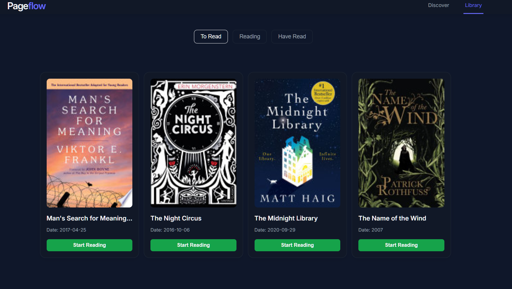
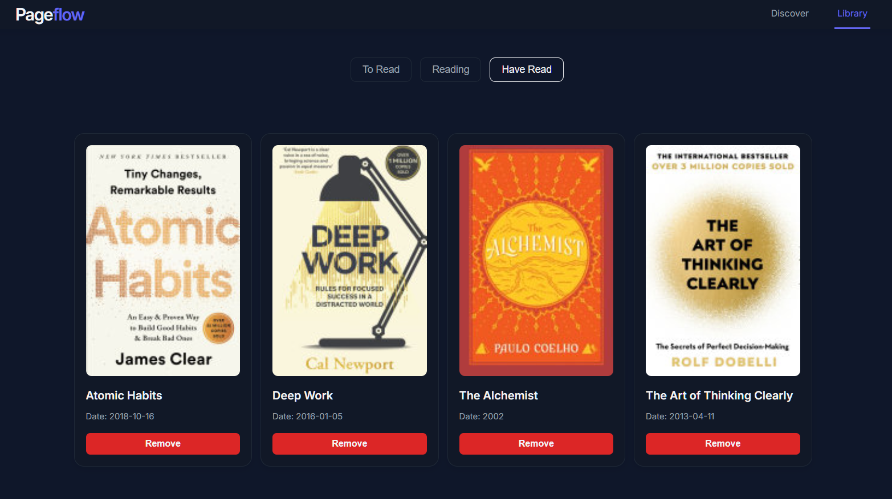

# Pageflow

A **personal reading workflow manager** built with React.  
Track your books, monitor reading progress, add book to your to read list, all in a **clean, mobile-first interface**.

---

## 🌟 Project Overview

Pageflow helps users manage their personal reading habits efficiently.  
Users can:

- Discover new books via a public Books API
- Save books they want to read
- Track reading progress in percentages
- Move books through stages: To Read → Reading → Read
- Add personal notes and summaries per book

The app is **mobile-first**, responsive, and stores all data locally using `localStorage`.

---

## 📌 Features

- **Discover books:** Search by title, author, or genre  
- **Reading states:** To Read, Reading, Read (mutually exclusive)  
- **Progress tracking:** Update reading progress in percentages  
- **Notes & summaries:** Add personal notes for finished books  
- **Responsive design:** Works seamlessly on mobile and desktop  
- **Local persistence:** Data saved in `localStorage`  

---

## 🖼 Screenshots



---

## 🛠 Tech Stack

- **React** – Frontend library for UI  
- **JavaScript (ES6)** – Core scripting language  
- **CSS (Custom)** – Styling with modern, minimal design  
- **localStorage** – Persist user data locally  
- **GOOGLE Books API** – Fetch book data dynamically (Google Books API)  

---

## 🚀 Getting Started

1. **Clone the repository**  
```bash
git clone https://github.com/<your-username>/pageflow.git
cd Pageflow
npm i
npm run dev
